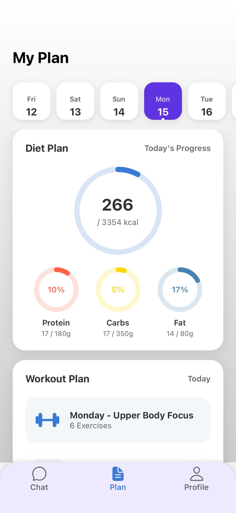
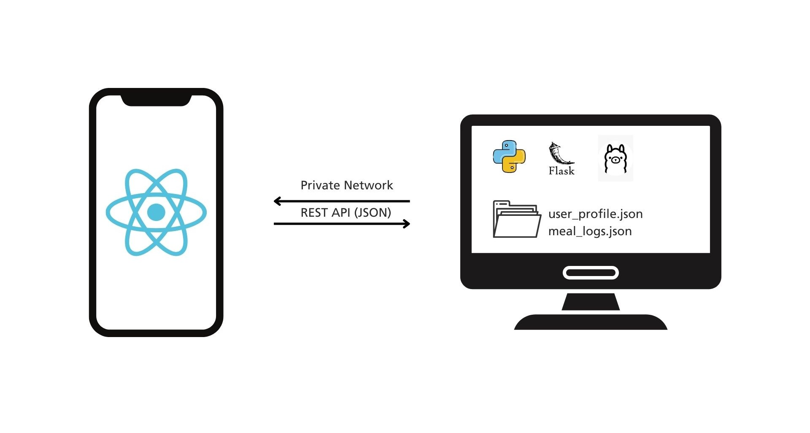

# 📱 PocketCoach: 100% Private AI Fitness Coach

  

## 👤 Developer Profile
- **Name:** Mifdzal Irfan Bin Marwan (이르판)
- **Role:** Backend Developer (Passionate about building systems that solve real-world problems)
- **Contact:** 
  
  

---

## 🚨 The Problem
Traditional health and fitness applications often force users to make a compromise between **effectiveness** and **privacy**:

1. **Tedious Manual Logging:** Manually tracking complex meals (such as Korean stews like '찌개') is tedious, leading to high user churn rates.
2. **Rigid, One-Size-Fits-All Plans:** These apps fail to adapt to real-world variables, such as sudden company dinners ('회식') or a lack of available gym equipment.
3. **High Financial Cost:** Professional 1:1 human coaching from personal trainers or nutritionists is financially unsustainable for many users over the long term.
4. **Privacy Risks:** Cloud-based applications require users to upload sensitive health data and physical metrics to external servers, creating data privacy vulnerabilities.

> 💡 **PocketCoach solves these challenges by providing a 100% private, locally executed, and adaptive AI coaching system.**

---

## 🛠 Architecture & Tech Stack

### System Architecture
Designed with a **100% local client-server architecture** that prioritizes user privacy above all else:
- **Backend (Brain):** A local PC-hosted Flask server that controls an open-source LLM via Ollama and manages the RAG pipeline.
- **Frontend (Face):** An Expo-based React Native cross-platform mobile application that communicates securely with the backend over a local Wi-Fi network.
- **RAG System:** Utilizes a massive database of over 160,000+ public food items (CSV) combined with verified, scientific health and fitness literature (PDF).

  

### Tech Stack Breakdown
| Category | Technologies & Tools |
| :--- | :--- |
| **Frontend** |    |
| **Backend & AI** |   `Ollama (LLM)` `Faiss-CPU (RAG)`  |
| **Tools** |   `JSON/CSV` |

---

## ✨ Core Features

### 1️⃣ RAG-Based Conversational Diet Logging
- **Natural Language Interface:** Users can log meals naturally via chat (e.g., "I ate 300g of Kimchi Jjigae"), and the AI instantly understands the intent.
- **High-Speed Vector Search:** The backend leverages `Faiss-CPU` to query the massive 160k+ food database in real time, extracting precise nutritional values and syncing them instantly to the UI.
- *Related Visual: `image/mealLogging.jpeg`*

### 2️⃣ Dynamic Adaptive Planning
- **Personalized Onboarding:** Generates a custom workout and nutrition blueprint tailored to the user's initial goals and physical metrics gathered during onboarding.
- **Real-Time Feedback Loop:** If a user modifies their goals or constraints mid-routine via chat (e.g., "I have a business trip next week" or "I gained weight"), the AI dynamically shifts gears and recalculates the entire routine on the fly.
- *Related Visual: `image/planPage.jpeg`*

### 3️⃣ Flexible 1:1 Fitness Coaching
- **Science-Backed Insights:** Answers health and fitness queries like "What is the optimal nutrient timing for muscle growth?".
- **Hallucination-Free Responses:** By pulling contextual knowledge from embedded, verified scientific PDF documents through RAG, the AI delivers highly reliable, accurate guidance instead of making up answers.
- *Related Visual: `image/coaching.jpeg`*

---

## 📈 Outcomes & Retrospective

### My Role & Contributions
- **Solo Full-Stack Development:** Independently owned and executed the entire project pipeline, from initial planning and backend API design to building the RAG engine and engineering the mobile frontend UI/UX.
- **Data Engineering:** Cleaned, structured, and optimized the embedding pipelines for heterogeneous data sources, including a 160,000+ row public food nutrient CSV and workout guide JSON files.
- **Search & AI Pipeline Optimization:** Combined `Faiss-CPU` with `Sentence-Transformers` to significantly reduce query latency and drastically improve semantic retrieval accuracy.

### Key Outcomes
- Successfully demonstrated a **100% privacy-preserving AI coaching infrastructure** running entirely on local hardware without public cloud dependencies.
- Built a highly responsive user feedback loop that simulates actual adaptive, real-time coaching dynamics.

### Key Takeaways
- Mastered the practical mechanics of building an end-to-end RAG architecture from scratch, specifically focused on data preprocessing and vector search optimization.
- Deepened expertise in privacy-centric AI backend infrastructure by hosting and controlling open-source LLMs locally using `Ollama`.
- Gained hands-on experience in building hybrid knowledge bases that gracefully combine structured data (CSV) with unstructured data (PDF).

### Future Roadmap
- **Seoul Smart Eater:** Build a dedicated web scraping pipeline to ingest and update real-time nutritional data from local South Korean convenience stores and popular franchises.
- **True On-Device AI:** Integrate Apple Core ML or MediaPipe to migrate processing entirely onto the smartphone, eliminating the need for a separate desktop Flask server.
- **Multimedia Integration:** Expand the coaching experience by implementing an in-app video player that triggers specific video guides based on the workout routine generated by the AI.

---
Copyright © 2024 Mifdzal Irfan Bin Marwan. All rights reserved.
